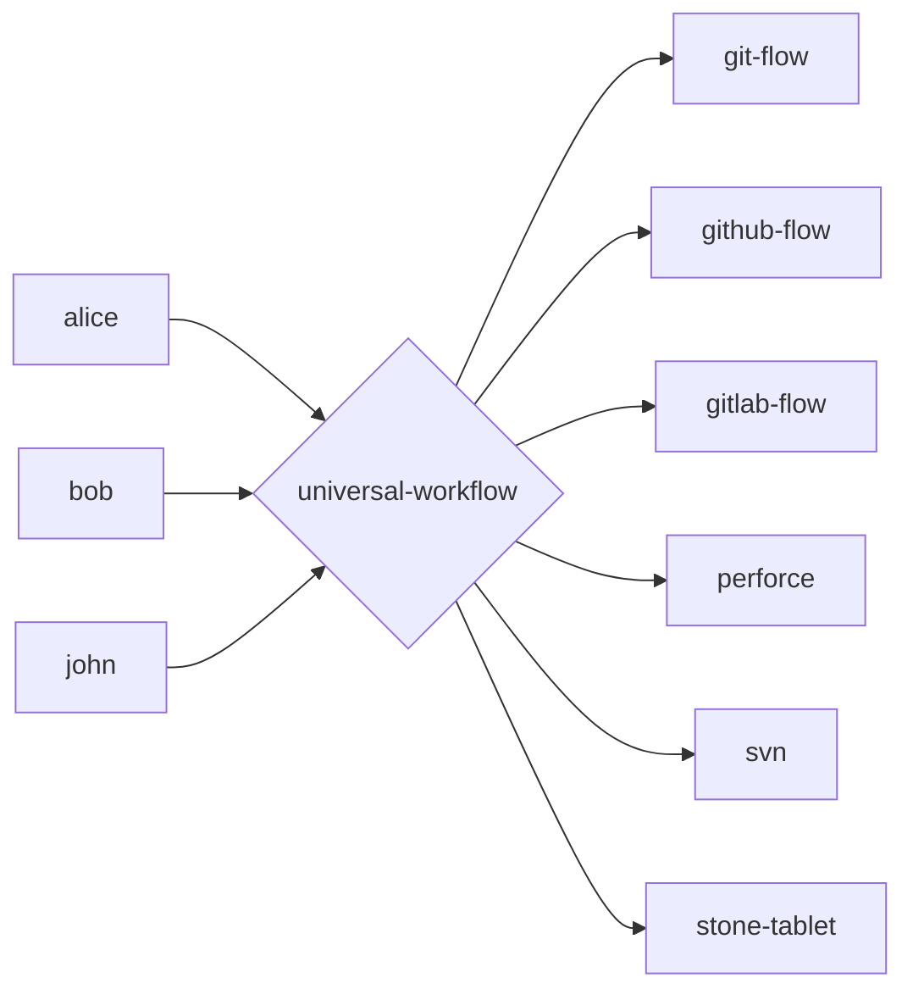

# universal-workflow
Work the way YOU want and universal-workflow (UWf) converts your personal workflow into a universal intermediate AST that maps to all the popular team workflows!

```mermaid
flowchart LR
alice --> U{universal-workflow}
bob --> U
john --> U
U --> git-flow
U --> github-flow
U --> gitlab-flow
U --> perforce
U --> svn
U --> stone-tablet

```

